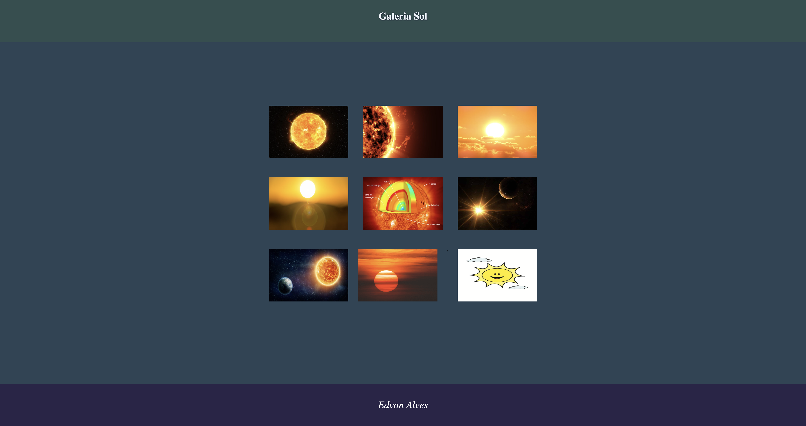

# 1-Galeria

Segunda atividade realizada, introdução a VSCode, HTML e CSS, desenvolvido nas aulas da disciplina linguagem de Marcação do curso Desenvolvimento de Sistemas no Senai

## Tecnologias utilizadas
* HTML
* CSS

## Autor

[Edvan Alves](https://br.linkedin.com/in/edvan-alves)